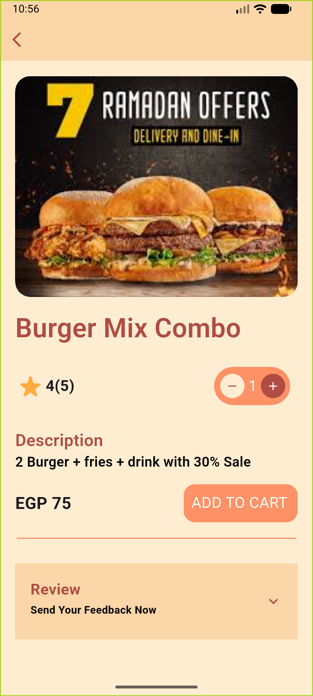

# Eat Screen - My First Flutter UI 🍔

Welcome to my first Flutter project! This is a modern Food UI screen designed with Flutter.

## 🚀 About the Project
This project focuses on building a clean and responsive User Interface for a food delivery or restaurant application. It's my very first step into the world of Flutter development.

## ✨ Features
* **Modern Design:** Clean and attractive layout.
* **Responsive:** Works on different screen sizes.
* **Organized Code:** Clear folder structure inside the `lib` folder.

## 🛠️ How to Run
1. Make sure you have Flutter installed.
2. Clone the repository.
3. Run the following command in the terminal to get dependencies:
   ```bash
   flutter pub get
   